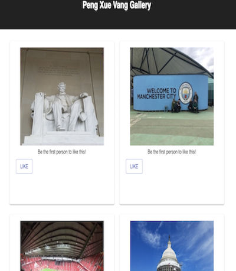

# My Gallery - Gallery of My Life

My Gallery is an app where I have uploaded various pictures I have taken in my life. Click on the picture provides a brief description about the picture. If you enjoy the photo, you can click on the "like" button which will then show how many people like the photo.

## Prerequisites

Before you get started, make sure you have the following software installed on your computer:

- [Node.js](https://nodejs.org/en/)
- [Nodemon](https://nodemon.io/)

## Features

* Click on the picture to display its description
* If you enjoy the photo, hit that like button! 

